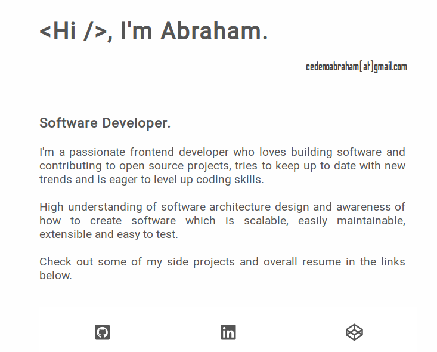

# Abra.io

This is a personal website, generated with the static site generator gatsby, the idea behind this is to have my own web site, ( simple but better than having none ), to show a summary of who i am and to share relevant information about my overall experience in the field.

Below is a screenshot of how it looks like:

<p align="center">
    
</p>

## 🚀 Quick start

1.  **Clone the repo.**

    Use the following command to download the project to your machine

    ```shell
    git clone https://github.com/wwwleak/abra.io.git
    ```

1.  **Start developing.**

    Navigate into the site’s directory and start it up.

    ```shell
    cd abra.io/
    gatsby develop
    ```

1.  **Open the source code and start editing!**

    Your site is now running at `http://localhost:8000`!

    _Note: You'll also see a second link: _`http://localhost:8000/___graphql`_. This is a tool you can use to experiment with querying your data. Learn more about using this tool in the [Gatsby tutorial](https://www.gatsbyjs.org/tutorial/part-five/#introducing-graphiql)._

## 💫 Deploy

This web page was deployed with netlify

<p align="right">MADE WITH ❤ BY ABRAHAM</p>
